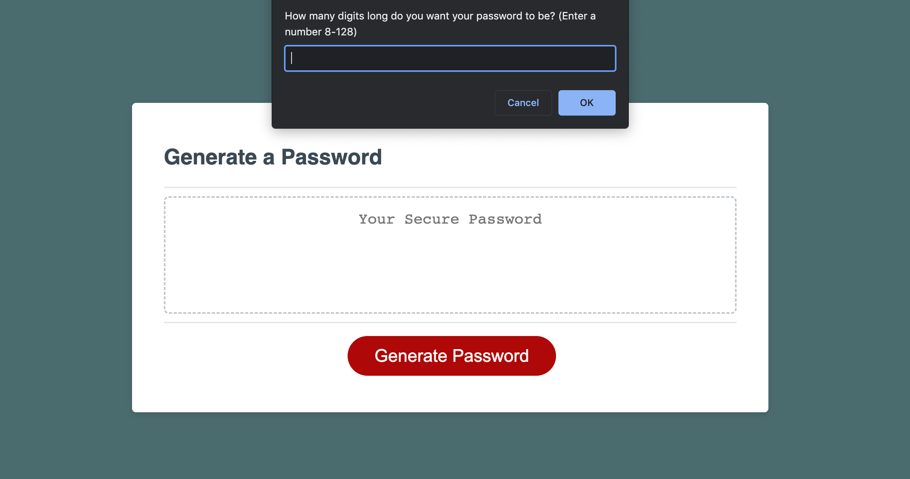

# Password Machine :lock:

This browser app features dynamically updated HTML and CSS powered by JavaScript code to created a new password each time a button is pressed.

**Deployed Site:** [Generator](https://armandosjunior.github.io/Password-Generator/)


## **Some Technical Features Include:**
```
- Functionality of cancel button confused order of how question responses execute.
- Presentation of generated password.
```

## **Mock Up:**


## **Steps for future development:**
```
- Adjust Javascript to successfully push a new password.
- Continue to adjust CSS starter code to my personalized style.
- Inset a copy button after code is presented.
```

